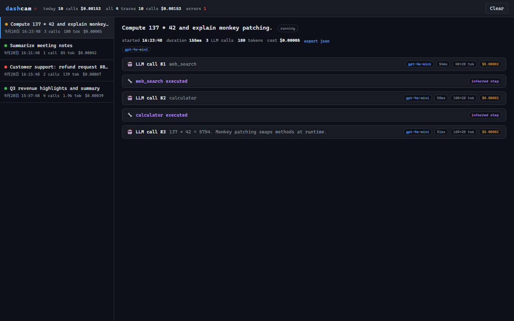

<div align="center">


# dashcam

**给你的 AI Agent 装一台行车记录仪。**

零配置、本地优先的 LLM/Agent 链路追踪、回放与成本调试工具。

[快速开始](#快速开始) · [工作原理](#工作原理) · [配置](#%EF%B8%8F-配置) · [常见问题](#常见问题)

[English](README.md) | **简体中文** | [日本語](README.ja.md) | [한국어](README.ko.md) | [Español](README.es.md) | [Français](README.fr.md) | [Deutsch](README.de.md) | [Русский](README.ru.md) | [Português (Brasil)](README.pt-BR.md) | [हिन्दी](README.hi.md)

</div>

---

凌晨两点，你的 Agent 挂了。*哪一次*调用失败的？它*实际*发了什么 prompt？整次运行花了多少钱、token 花在哪了？

汽车行车记录仪在后台默默录下一切——出事时回放录像，一清二楚。**dashcam 对 LLM 应用做的就是这件事**：静默录制程序发出的每一次 LLM 调用，然后给你一个本地时间线来回放、检查、归因。

## 为什么选 dashcam

| | dashcam | LangSmith / Langfuse | print() 调试 |
|---|---|---|---|
| 需要改代码 | **完全不用** | SDK / 装饰器 | 到处都是 |
| 数据出机器 | **从不出本机** | 云端或自建服务 | - |
| 依赖 | **零依赖**（纯标准库） | 服务端 + 数据库 + SDK | - |
| 上手时间 | 10 秒 | 几分钟到几小时 | - |
| 成本统计 | 内置 | 视方案而定 | 手算 |
| 框架无关 | 是（直接 patch SDK） | 通常绑定框架 | - |

## 快速开始

```bash
pip install dashcam
dashcam demo        # 生成演示数据，无需 API Key
dashcam             # 打开面板 http://127.0.0.1:8377
```

### 方式 A —— 零代码改动（推荐）

```bash
dashcam install                          # 一次性安装 .pth 钩子
DASHCAM=1 python your_agent.py           # 完事，全程被录制
```

Windows 下：`set DASHCAM=1 && python your_agent.py`

### 方式 B —— 一行导入

```python
import dashcam
dashcam.instrument()   # 自动 patch 已安装的 openai / anthropic / litellm
```

### 方式 C —— 显式 trace 边界（可选）

```python
with dashcam.trace("退款处理Agent") as tid:
    run_agent()   # 内部所有 LLM 调用归入同一条 trace
```

不写显式边界也没关系：调用会按线程 + 活动间隔自动归组，零改动。

## 你能得到什么

<p align="center">
  
</p>

- **时间线回放** —— 按顺序展示每一次 LLM 调用，完整请求消息、参数、工具定义、响应，点击展开
- **隐式工具步骤推断** —— dashcam 对比相邻两次调用的消息数组，还原*调用之间 Agent 做了什么*（工具执行、用户输入），**不需要接入任何框架**
- **失败归因** —— 失败调用红色高亮并附完整异常，trace 列表一眼看出哪次运行出错
- **成本与 token 记账** —— 每次调用、每条 trace 的 token 数与美元成本估算，内置 OpenAI / Anthropic / DeepSeek / Gemini / Qwen 常见模型价格，支持 `DASHCAM_PRICES` 自定义价目表
- **流式支持** —— 流式响应自动重组记录，包括 tool-call 分片
- **本地与隐私** —— 所有数据存在单个 SQLite 文件（`~/.dashcam/traces.db`），无服务端、无账号、无遥测

## 工作原理

```
                    你的程序
                       │
          openai / anthropic / litellm SDK 调用
                       │
            ┌──────────▼──────────┐
            │  dashcam patcher    │   启动时 monkey-patch SDK 入口
            │  （零配置）           │   记录请求 / 响应 / usage
            └──────────┬──────────┘
                       │
            ┌──────────▼──────────┐
            │  SQLite 存储         │   ~/.dashcam/traces.db
            └──────────┬──────────┘
                       │
            ┌──────────▼──────────┐
            │  本地面板            │   标准库 http.server，端口 8377
            │  回放 · 成本          │   trace 列表、时间线、JSON 导出
            └─────────────────────┘
```

### 支持的 SDK

| SDK | 入口 | 同步 | 异步 | 流式 |
|---|---|---|---|---|
| openai >= 1.0 | `chat.completions.create`、`responses.create` | ✅ | ✅ | ✅ |
| anthropic | `messages.create`、`messages.stream` | ✅ | ✅ | ✅ |
| litellm | `completion`、`acompletion` | ✅ | ✅ | ✅ |

经由这些入口的调用（LangChain、AutoGen、CrewAI、litellm 路由的 OpenAI 兼容端点……）都会被自动捕获。

## ⚙️ 配置

| 环境变量 | 默认值 | 含义 |
|---|---|---|
| `DASHCAM` | 未设置 | 设为 `1` 时，`.pth` 钩子在解释器启动时自动插桩 |
| `DASHCAM_DB` | `~/.dashcam/traces.db` | SQLite 数据库路径 |
| `DASHCAM_PRICES` | 内置价目表 | JSON 价目表路径：`{"模型子串": [输入每百万token价格, 输出每百万token价格]}` |

价格按子串匹配、最长键优先（如 `gpt-4o-mini` 优先于 `gpt-4o`）。价格为估算值，对账级精度请自行覆盖价目表。

## 常见问题

**会拖慢我的 Agent 吗？**
每次 LLM 调用只多一次 SQLite 插入（微秒级），而 LLM 调用本身动辄几百毫秒，感知不到。

**dashcam 自己出问题怎么办？**
所有 dashcam 内部逻辑都有防御性包裹——dashcam 内部任何异常都会被吞掉，你的程序完全不受影响。

**数据会发到外面吗？**
不会。无网络调用、无遥测、无账号，面板只绑定 127.0.0.1。

**调用怎么归组成 trace？**
显式用 `dashcam.trace(name)`，或自动归组：同线程、5 分钟活动间隔内的调用归入同一 trace，空闲后自动闭合。

**流式响应呢？**
分片（文本、tool-call 片段、usage）被累积，流结束时统一记录。OpenAI 的 `stream_options={"include_usage": True}` 会被正常捕获。

## 开发

```bash
git clone https://github.com/<you>/dashcam
cd dashcam
pip install -e ".[dev]"
pytest                          # 23 个测试，无需 API Key
python examples/demo_agent.py   # 离线 Agent 循环演示
```

## Roadmap

- [ ] MCP 工具调用捕获
- [ ] Prompt diff 视图（相邻调用改了什么）
- [ ] 全量 trace 搜索
- [ ] 单步时间旅行回放到 REPL
- [ ] 框架适配（LangChain 回调、OpenTelemetry 桥接）

## 许可

MIT
